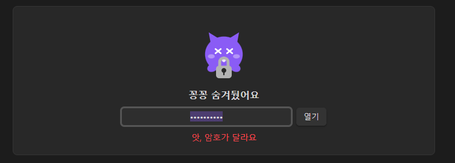
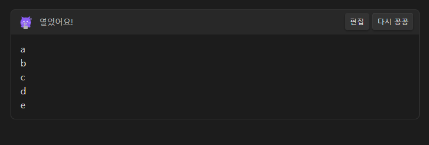
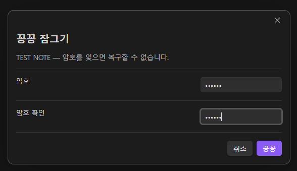

<div align="center">

[](README.md)
[](README.ko.md)

</div>

# 꽁꽁이 (Kkongkkongi)

노트를 꽁꽁 숨겨주는 옵시디언 플러그인입니다. 꽁꽁이가 자물쇠를 안고 지켜주다가, 암호를 넣으면 그 자리에서 내용을 펼쳐 보여줍니다.


---

## 왜 만들었나

암호를 거는 플러그인 중에는 **화면만 가리고 파일 내용은 평문으로 두는** 것이 있습니다. 그런 경우 `.md` 파일을 메모장으로 열면 내용이 그대로 보입니다.

꽁꽁이는 **파일에 저장되는 내용 자체를 암호화**합니다. 잠긴 노트를 텍스트 편집기로 열면 암호문만 보입니다.

## 특징

- **실제 암호화** — AES-256-GCM, 키는 scrypt 로 유도
- **인라인 해제** — 모달 없이 노트 안에서 바로 펼쳐짐
- **자동 재잠금** — 다른 노트로 이동 / 창 포커스 이탈 / 시간 경과
- **평문 미저장** — 복호화 결과는 화면에만 존재
- **변조 감지** — 암호문이 손상되면 GCM 인증 태그 검증에 실패해 열리지 않음
- **테마 대응** — 캐릭터 색이 라이트/다크 테마를 따라감
- **한국어·영어** — 옵시디언 언어 설정을 따르며 설정에서 고정 가능

## 화면

암호가 틀리면 꽁꽁이가 놀라서 부르르 떨다가 원래 표정으로 돌아옵니다.



맞히면 그 자리에서 내용이 마크다운으로 펼쳐집니다.



옵시디언을 영어로 쓰면 인터페이스도 영어로 나옵니다.


## 사용법

명령 팔레트(`Ctrl/Cmd + P`):

| 명령 | 동작 |
| --- | --- |
| 이 노트 꽁꽁 잠그기 | 암호를 두 번 입력받아 노트를 암호화 |
| 이 노트 잠금 영구 해제 | 평문으로 되돌림 |
| 열려 있는 것 모두 다시 꽁꽁 | 펼쳐진 내용을 즉시 다시 잠금 |



잠근 뒤에는 그 노트를 열 때마다 꽁꽁이가 암호를 묻습니다. 암호를 넣으면 내용이 마크다운으로 렌더링되고, 다른 노트로 이동하면 다시 잠깁니다.

## 설정

| 설정 | 기본값 |
| --- | --- |
| 언어 | 옵시디언 설정 따르기 |
| 꽁꽁이 보여주기 | 켬 |
| 다른 노트로 가면 다시 꽁꽁 | 켬 |
| 창을 벗어나면 다시 꽁꽁 | 켬 |
| 자동 잠금 시간(초) | 0 (사용 안 함) |

## 저장 형식

잠근 노트는 이렇게 저장됩니다.

~~~
```kkong-v1
{"v":1,"salt":"...","iv":"...","tag":"...","data":"..."}
```
~~~

| 항목 | 값 |
| --- | --- |
| 알고리즘 | AES-256-GCM |
| 키 유도 | scrypt (N=32768, r=8, p=1), 32바이트 키 |
| salt | 16바이트, 잠글 때마다 새로 생성 |
| IV | 12바이트, 잠글 때마다 새로 생성 |
| 인증 태그 | 16바이트 |

Node.js 내장 `crypto` 모듈의 표준 조합만 사용합니다. 자체 설계한 암호 알고리즘은 없습니다.

## 주의

> [!WARNING]
> **암호를 잊으면 복구할 수 없습니다.** 설계상 복구 수단이 존재하지 않습니다. 중요한 노트는 잠그기 전에 백업하세요.

- 암호화된 노트는 **본문 검색과 그래프 뷰에서 제외**됩니다. 파일에 암호문만 있기 때문입니다.
- **소스 모드에서는 암호문이 그대로 보입니다.** 읽기 뷰와 라이브 프리뷰에서만 펼쳐집니다.
- Node 의 `crypto` 를 사용하므로 **데스크톱 전용**입니다.
- 플러그인은 디스크 자체를 보호하지 않습니다. 기기 도난까지 대비하려면 BitLocker, FileVault, Cryptomator 같은 디스크 암호화를 함께 쓰세요.

## 설치

### 커뮤니티 플러그인

설정 → 커뮤니티 플러그인 → 찾아보기 → `Kkongkkongi` 검색 → 설치 → 활성화

### 수동 설치

1. [Releases](https://github.com/applan/obsidian-kkongkkongi/releases) 에서 `manifest.json`, `main.js`, `styles.css` 다운로드
2. `<보관함>/.obsidian/plugins/kkongkkongi/` 폴더에 넣기
3. 옵시디언 재시작 후 활성화

## 개발

빌드 단계가 없습니다. `main.js` 는 CommonJS 로 직접 작성되어 있어 그대로 실행됩니다.

```bash
node --check main.js     # 구문 검사
node test/test.js        # 테스트 (암호화 · 포맷 · 다국어 · 상태 전이 · 캐릭터)
```

언어를 추가하려면 `main.js` 의 `LOCALES` 에 두 글자 코드로 테이블을 추가하고 언어 드롭다운에 옵션을 넣으면 됩니다. 테스트가 로케일 간 키 누락과 치환 변수 불일치를 검사합니다.

## 라이선스

MIT
