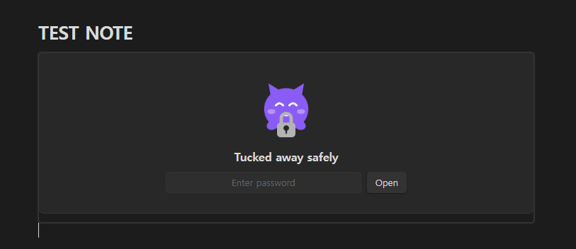
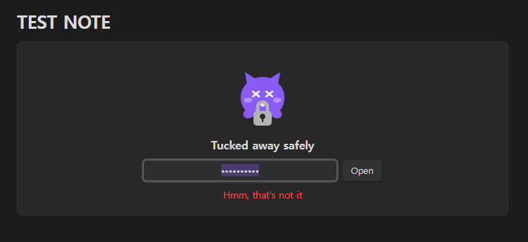
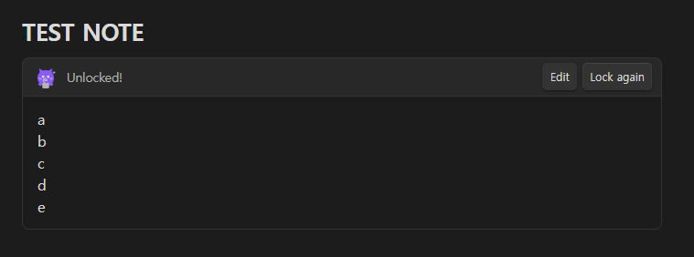
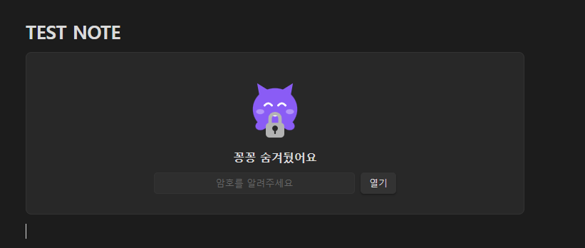
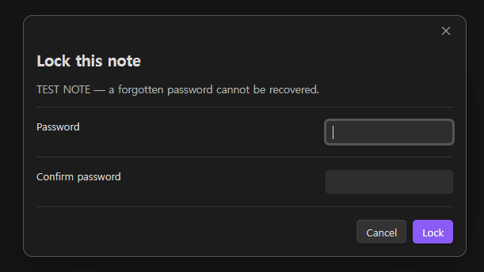

<div align="center">

[](README.md)
[](README.ko.md)

</div>

# Kkongkkongi

Encrypt a note and unlock it right where it sits. A little character hugs a padlock while your note is locked, and hands it back when you enter the password.



---

## Why this exists

Some "lock" plugins only cover the screen — the `.md` file stays in plaintext, so opening it in any text editor reveals everything.

Kkongkkongi encrypts **the content that gets written to disk**. Open a locked note in Notepad and you see ciphertext.

## Features

- **Real encryption** — AES-256-GCM, key derived with scrypt
- **Inline unlock** — no modal; the content unfolds inside the note
- **Locks itself again** — on leaving the note, losing window focus, or after a timeout
- **Plaintext never hits disk** — decrypted content lives only in the DOM
- **Tamper detection** — a damaged ciphertext fails the GCM auth tag check
- **Theme aware** — the character follows your light/dark theme
- **English and Korean** — the interface follows Obsidian's language, or pin one in the settings

## How it looks

Get the password wrong and the character is startled — it shakes, then settles back.



Get it right and the note unfolds in place, fully rendered as markdown.



The same note with Obsidian set to Korean:



## Usage

Command palette (`Ctrl/Cmd + P`):

| Command | What it does |
| --- | --- |
| Lock this note | Asks for a password twice, then encrypts the note |
| Remove lock permanently | Writes the content back as plaintext |
| Lock everything that is open | Immediately re-locks any unlocked block |



After locking, opening that note shows the character asking for a password. Enter it and the content renders as markdown. Move to another note and it locks again.

## Settings

| Setting | Default |
| --- | --- |
| Language | Follow Obsidian |
| Show the character | On |
| Lock when leaving the note | On |
| Lock when the window loses focus | On |
| Auto-lock after (seconds) | 0 (off) |

## Storage format

A locked note is stored like this:

~~~
```kkong-v1
{"v":1,"salt":"...","iv":"...","tag":"...","data":"..."}
```
~~~

| | |
| --- | --- |
| Cipher | AES-256-GCM |
| Key derivation | scrypt (N=32768, r=8, p=1), 32-byte key |
| salt | 16 bytes, regenerated on every lock |
| IV | 12 bytes, regenerated on every lock |
| Auth tag | 16 bytes |

Only standard primitives from Node's built-in `crypto` module. No home-grown cryptography.

## Caveats

> [!WARNING]
> **A forgotten password cannot be recovered.** There is no recovery path by design. Back up important notes before locking them.

- Encrypted notes are **excluded from content search and the graph view** — the file only holds ciphertext.
- **Source mode shows the ciphertext.** Content unfolds in Reading view and Live Preview.
- Uses Node's `crypto`, so it is **desktop only**.
- This does not protect the disk itself. Pair it with BitLocker, FileVault or Cryptomator if you are worried about a stolen device.

## Installation

### Community plugins

Settings → Community plugins → Browse → search `Kkongkkongi` → Install → Enable

### Manual

1. Download `manifest.json`, `main.js` and `styles.css` from [Releases](https://github.com/applan/obsidian-kkongkkongi/releases)
2. Put them in `<vault>/.obsidian/plugins/kkongkkongi/`
3. Restart Obsidian and enable the plugin

## Development

No build step — `main.js` is plain CommonJS and runs as written.

```bash
node --check main.js     # syntax
node test/test.js        # tests: crypto, format, i18n, state transitions, character
```

Adding a language: add a table to `LOCALES` in `main.js` keyed by the two-letter code, and add the option to the language dropdown. The test suite checks that every locale has the same keys and the same placeholders.

## License

MIT
